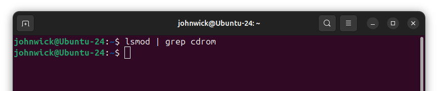
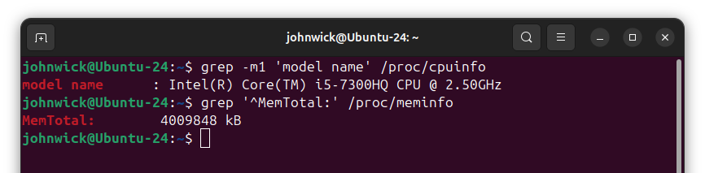

### Задание 1. Kernel and Module Inspection

#### 1) Версия ядра

#### 2) Все загруженные модули ядра

#### 3) Отключить автозагрузку модуля cdrom

> Модуль cdrom отсутствует

#### 4) Найти и описать конфигурацию ядра (CONFIG_XFS_FS)

`CONFIG_XFS_FS=m` - поддержка XFS как модуль (`xfs.ko`), загрузится при монтировании XFS.

### Задание 2. Наблюдение за VFS

- Открытия:

  - `openat(..., "/etc/ld.so.cache", O_RDONLY)` - кэш динамического линковщика
  - `openat(..., "/lib/x86_64-linux-gnu/libc.so.6", O_RDONLY)` - загрузка `libc`
  - `openat(..., "/usr/lib/locale/locale-archive", O_RDONLY)` - данные локали
  - **Главное:** `openat(..., "/etc/os-release", O_RDONLY) = 3` - целевой файл, обычный текст

- Чтение/запись:

  - `read(3, "PRETTY_NAME=...", 131072) = 400` - прочитано 400 байт из `/etc/os-release`
  - `write(1, "PRETTY_NAME=...", 400) = 400` - запись в `fd 1` (stdout), который перенаправлён на `/dev/null`
  - Далее `read(...)=0` - EOF, затем `close(3)`

- Почему не видно открытия `/dev/null`:

  - Перенаправление `> /dev/null` делает bash до запуска `cat`: он открывает `/dev/null` и подменяет stdout. Процесс `cat` лишь наследует готовый fd 1, поэтому в `strace` на `cat` нет `open("/dev/null")`

### Задание 3. LVM Management

#### 1. Разметка диска под LVM (GPT + один раздел)

#### 2. PV и VG

#### 3. LVs: 1200MiB и всё остальное

#### 4. Файловые системы

#### 5. Точки монтирования и монтирование

#### 6. Автомонтирование

### Задание 4. Использование pseudo filesystem

#### 1) Модель CPU и объём памяти (KiB)

#### 2) PPid через `/proc/$$/status` и что значит `$$`

`$$` - это PID текущего shell (переменная оболочки). Значит, `/proc/$$/status` - статус именно текущего shell-процесса.

#### 3) I/O-планировщик для `/dev/sda`

#### 4) MTU основного сетевого интерфейса

