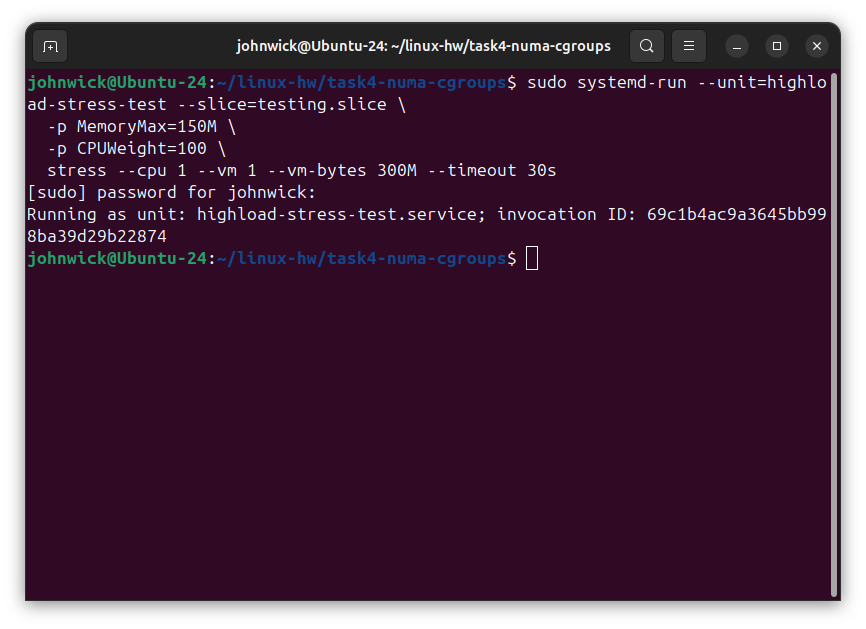
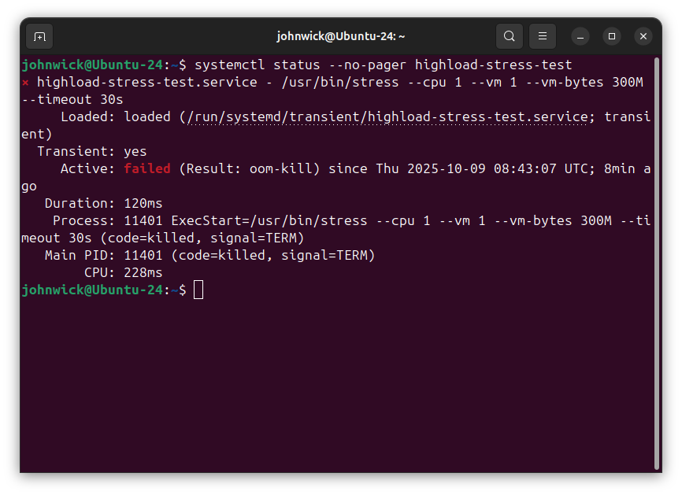

### Задание 1. Systemd

#### 1) bash-скрипт /usr/local/bin/homework_service.sh

#### 2) systemd unit

> лежит в /etc -> переживёт обновления

#### 3) Проверка работы + авто-рестарт

- статус

  

- сердцебиение

  

- падение

  

- поднимется через 15 c

  

  

#### 4) Топ-5 самых долгих unit’ов при старте

### Задание 2. Межпроцессное взаимодействие (IPC) с разделяемой памятью

#### 1) Создание и запуск создатель сегмента (SysV SHM)

> `nattch = 0`, т.к. создатель сегмент не прикреплял (`shmat`) - он лишь создал.

#### 2) Сделаем присоединение, чтобы показать рост `nattch`

Проверяем `nattch`:

#### Итог

- `nattch` - текущее число процессов, прикреплённых к сегменту через `shmat`.
- В `shm_creator` `nattch=0`, т.к. мы сегмент создали, но не прикрепили.
- Каждый запущенный `shm_attacher` увеличивает `nattch` на 1

### Задание 3. Анализ памяти процессов (VSZ vs RSS)

- **VSZ (Virtual Size)** - всё виртуальное адресное пространство процесса: анонимные области, стек, heap, mmap’ы библиотек и т.п. Поэтому **VSZ > RSS**.
- **RSS (Resident Set Size)** - фактически загруженные в RAM страницы. Мы заполнили строку `'X' * 250MiB`, страницы действительно были записаны -> они были подкачаны в память, поэтому **RSS <> 0** и близок к 250 MiB + накладные расходы интерпретатора/аллокатора и библиотек.
- Разница между VSZ и RSS - это не загруженные страницы и file-backed маппинги, которые могут быть не в RAM или разделяться.

### Задание 4. NUMA и cgroups

#### 1) NUMA-топология

#### 2) Ограничение через systemd

Запускаем стресс с лимитами:

- **Будет ли работать тест при 300M запросе и 150M лимите?** Нет. При достижении лимита срабатывает OOM внутри cgroup, процесс убивается.
- **Превысило ли использование памяти 150M?** Нет, `memory.current` не превышает `memory.max`. При попытке выше - OOM-kill, что видно по `Result=oom-kill`.
- **Что делают `MemoryMax` и `CPUWeight`?**

  - `MemoryMax` - жёсткий потолок памяти для cgroup (`memory.max`). Превышение приводит к OOM внутри группы.
  - `CPUWeight` - относительный вес на планировщике CPU (1..10000). Больше вес -> больше доля CPU при конкуренции; без конкурентов не ограничивает.
