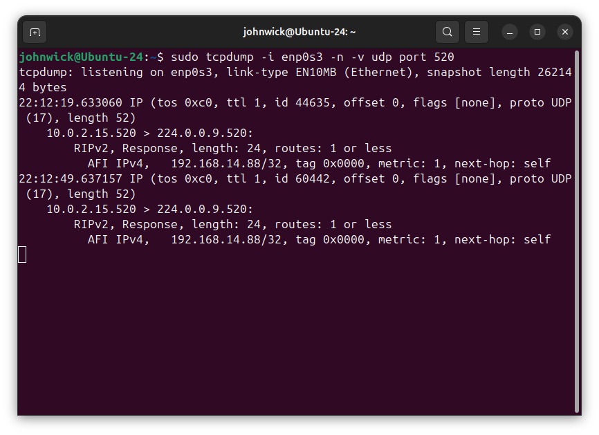

# Домашнее задание №4 - Сетевой стек

## Задание 1. Анализ состояний TCP-соединений

### Выполнение

**1. Запуск HTTP сервера:**
```bash
python3 -m http.server 8080
```


**2. Проверка слушающего сокета:**
```bash
ss -tlnp | grep 8080
```


**3. Подключение через curl:**
```bash
curl http://localhost:8080
```


**4. Анализ TCP-соединений:**
```bash
ss -tan | grep 8080
```


### Анализ TIME-WAIT

**Почему возникает TIME-WAIT:**
- Состояние возникает на стороне, которая активно закрывает соединение (клиент)
- Это финальное состояние TCP при четырёхэтапном закрытии
- Длительность: 2×MSL (≈60 секунд)

**Роль и почему нельзя удалить:**
1. Гарантия доставки последнего ACK - если ACK потеряется, сервер повторно отправит FIN
2. Предотвращение конфликтов пакетов - "старые" пакеты не попадут в новое соединение с теми же параметрами
3. Часть протокола TCP (RFC 793) - преждевременное удаление нарушит корректность закрытия

**Проблемы при большом количестве TIME-WAIT:**
- **Исчерпание портов** - в Linux ~28-60K эфемерных портов, все могут быть заняты
- **Потребление памяти** - каждый сокет ~3.5 KB (10K сокетов ≈ 35 MB)
- **Снижение производительности** - замедление создания новых соединений, критично для прокси и load balancers

---

## Задание 2. Динамическая маршрутизация с BIRD

### Выполнение

**1. Создание dummy-интерфейса service_0:**
```bash
sudo ip link add service_0 type dummy
sudo ip addr add 192.168.14.88/32 dev service_0
sudo ip link set service_0 up
ip addr show service_0
```


**2. Настройка BIRD:**

Конфигурация `/etc/bird/bird.conf`:
```conf
router id 192.168.14.88;

protocol device {
    scan time 10;
}

protocol direct {
    ipv4;
    interface "service_*";
}

protocol kernel {
    ipv4 {
        export all;
    };
}

protocol rip {
    ipv4 {
        import none;
        export filter {
            if net ~ 192.168.14.0/24 && net.len = 32 && ifname ~ "service_*" then accept;
            reject;
        };
    };
    interface "enp0s3" {
        version 2;
    };
}
```

Проверка статуса и маршрутов:
```bash
sudo birdc show protocols
sudo birdc show route
```


**3. Создание тестовых интерфейсов:**
```bash
# service_1 - маска /30, НЕ должен анонсироваться
sudo ip link add service_1 type dummy
sudo ip addr add 192.168.14.1/30 dev service_1
sudo ip link set service_1 up

# service_2 - не из подсети 192.168.14.0/24, НЕ должен анонсироваться
sudo ip link add service_2 type dummy
sudo ip addr add 192.168.10.4/32 dev service_2
sudo ip link set service_2 up

# srv_1 - имя не начинается на "service_", НЕ должен анонсироваться
sudo ip link add srv_1 type dummy
sudo ip addr add 192.168.14.4/32 dev srv_1
sudo ip link set srv_1 up

ip addr show | grep -E "(service_|srv_)"
```


**4. Проверка анонсов через tcpdump:**
```bash
sudo tcpdump -i enp0s3 -n -v udp port 520
```


### Анализ результатов

**Фильтр BIRD работает корректно:**

Условия фильтра: `net ~ 192.168.14.0/24 && net.len = 32 && ifname ~ "service_*"`

| Интерфейс | IP-адрес | Подсеть 192.168.14.0/24 | Маска /32 | Имя "service_*" | Анонсируется |
|-----------|----------|-------------------------|-----------|-----------------|--------------|
| service_0 | 192.168.14.88/32 | Да | Да | Да | **Да** |
| service_1 | 192.168.14.1/30 | Да | Нет | Да | **Нет** |
| service_2 | 192.168.10.4/32 | Нет | Да | Да | **Нет** |
| srv_1 | 192.168.14.4/32 | Да | Да | Нет | **Нет** |

**Результат tcpdump:** анонсируется только `192.168.14.88/32` (service_0), что подтверждает корректность фильтрации.

---

## Задание 3. Настройка фаервола

### Выполнение

**1. Создание правила блокировки порта 8080:**
```bash
sudo iptables -A INPUT -p tcp --dport 8080 -j DROP
sudo iptables -L -n -v
```


**2. Запуск HTTP сервера:**
```bash
python3 -m http.server 8080
```


**3. Мониторинг трафика через tcpdump:**

В отдельном терминале запущен tcpdump для анализа пакетов:
```bash
sudo tcpdump -i lo -n tcp port 8080
```


**4. Попытка подключения через curl:**
```bash
curl http://localhost:8080
```


### Анализ работы фаервола

**Правило iptables:**
- `-A INPUT` - добавление правила в цепочку INPUT (входящий трафик)
- `-p tcp --dport 8080` - протокол TCP, порт назначения 8080
- `-j DROP` - действие DROP (отбросить пакет без ответа)

**Результат:**
- HTTP сервер запущен и слушает порт 8080
- При попытке подключения через curl соединение зависает и завершается по timeout
- В tcpdump видны SYN пакеты от клиента, но сервер не отвечает (пакеты отброшены фаерволом)
- Фаервол работает корректно, блокируя доступ к порту 8080

---

## Задание 4. Аппаратное ускорение сетевого трафика (offloading)

### Выполнение

**1. Исследование offload возможностей адаптера:**
```bash
ethtool -k enp0s3 | grep -i offload
```


**2. Проверка TCP segmentation offload:**
```bash
ethtool -k enp0s3 | grep -i "tcp-segmentation-offload\|tso"
```


### Анализ результатов

**TCP Segmentation Offload (TSO): включён (on)**

**Другие активные offload возможности:**
- `generic-segmentation-offload: on` - программная сегментация на уровне ядра
- `generic-receive-offload: on` - объединение входящих пакетов
- `rx-vlan-offload: on` - обработка VLAN меток при приёме
- `tx-vlan-offload: on` - обработка VLAN меток при передаче

### Назначение TCP Segmentation Offload

**Задача TSO:**

TCP Segmentation Offload решает задачу **переноса сегментации больших TCP-пакетов с CPU на сетевую карту**.

**Как работает без TSO:**
1. Приложение передаёт большой блок данных (например, 64 KB) в сокет
2. TCP-стек ядра разбивает данные на сегменты размером MTU (обычно 1500 байт)
3. Для каждого сегмента CPU вычисляет TCP/IP заголовки и контрольные суммы
4. Каждый пакет передаётся в сетевой адаптер отдельно

**Как работает с TSO:**
1. Приложение передаёт большой блок данных
2. TCP-стек передаёт его сетевой карте **одним большим пакетом** с минимальной обработкой
3. **Сетевая карта аппаратно** разбивает данные на сегменты MTU
4. Сетевая карта добавляет заголовки и вычисляет контрольные суммы

**Преимущества:**
- **Снижение нагрузки на CPU** - меньше обработки на уровне ядра
- **Увеличение пропускной способности** - CPU может обрабатывать больше данных
- **Уменьшение числа прерываний** - меньше взаимодействий между ядром и сетевой картой
- **Повышение производительности** - критично для высокоскоростных сетей (10G+)

**Типичный выигрыш:** снижение загрузки CPU на 20-40% при передаче больших объёмов данных.

