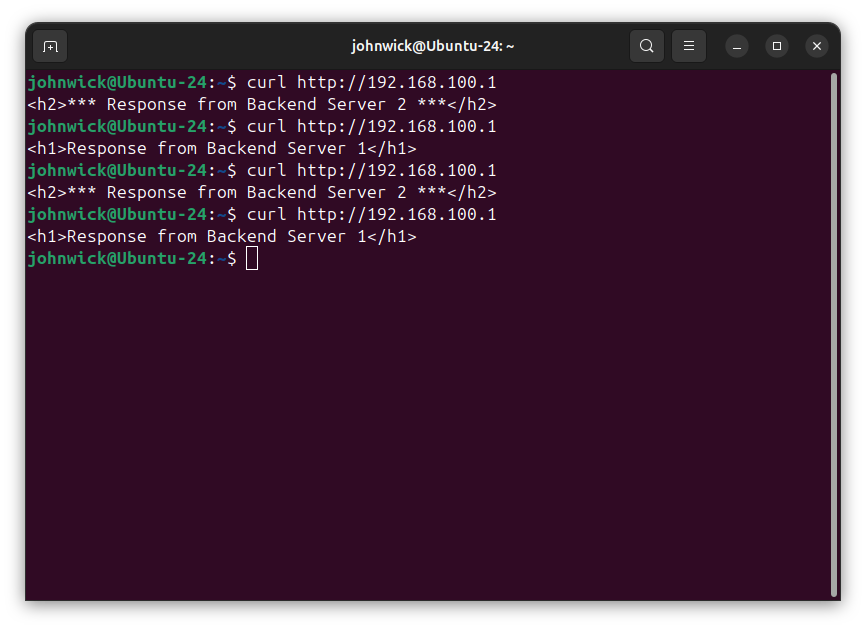

# Домашнее задание №5 - WEB. High Performance WEB и CDN

## Задание 1. Создание Server Pool для backend

### Выполнение

**1. Создание папок и index.html файлов:**
```bash
# Создание папок
mkdir -p ~/backend1 ~/backend2

# Создание index.html для backend1
echo '<h1>Response from Backend Server 1</h1>' > ~/backend1/index.html

# Создание index.html для backend2
echo '<h2>*** Response from Backend Server 2 ***</h2>' > ~/backend2/index.html
```

**2. Запуск HTTP серверов на портах 8081 и 8082:**

Backend 1 (порт 8081):
```bash
cd ~/backend1 && python3 -m http.server 8081
```


Backend 2 (порт 8082):
```bash
cd ~/backend2 && python3 -m http.server 8082
```


**3. Проверка работы серверов:**
```bash
curl http://localhost:8081
curl http://localhost:8082
```


### Результат

Созданы 2 backend сервера с разным содержимым:
- Сервер 1 работает на порту 8081 и возвращает `<h1>Response from Backend Server 1</h1>`
- Сервер 2 работает на порту 8082 и возвращает `<h2>*** Response from Backend Server 2 ***</h2>`

Оба сервера успешно отвечают на HTTP запросы, что подтверждается результатами curl.

---

## Задание 2. DNS Load Balancing с помощью dnsmasq

### Выполнение

**1. Настройка дополнительного IP-адреса на loopback интерфейсе:**
```bash
# Добавление 127.0.0.2 для второго backend сервера
sudo ip addr add 127.0.0.2/8 dev lo

# Проверка
ip addr show lo | grep 127.0.0

# Запуск backend2 на 127.0.0.2:8082
cd ~/backend2
python3 -m http.server 8082 --bind 127.0.0.2 &
```

**2. Настройка dnsmasq:**

Конфигурация `/etc/dnsmasq.conf`:


**3. Запуск dnsmasq:**

```bash
sudo dnsmasq -C /etc/dnsmasq.conf
```

**4. Проверка резолва через dig:**

Полный вывод dig:
```bash
dig @127.0.0.1 -p 5353 my-awesome-highload-app.local
```


Краткий вывод (только IP-адреса):
```bash
dig @127.0.0.1 -p 5353 my-awesome-highload-app.local +short
```


### Анализ DNS Load Balancing

**Результаты резолва:**

DNS-сервер dnsmasq возвращает оба A-записи при каждом запросе:
- `127.0.0.1` (backend1)
- `127.0.0.2` (backend2)

Порядок записей может меняться, но обычно DNS возвращает их в одинаковой последовательности.

**Что произойдёт при падении backend2:**

DNS Load Balancing имеет критический недостаток - **отсутствие health checks**. DNS-сервер продолжит возвращать оба IP-адреса (127.0.0.1 и 127.0.0.2), даже если backend2 недоступен. 

**Последствия:**
- Часть запросов будет проваливаться по timeout при обращении к упавшему серверу
- Клиенты получат оба адреса, но не знают какой из них доступен
- TTL кеширование усугубляет проблему - клиенты будут использовать устаревшие записи
- Нет автоматического исключения недоступных узлов из пула

**Вывод:** DNS Load Balancing подходит только для простых сценариев. Для production требуются балансировщики L4/L7 с активными health checks.

---

## Задание 3. Балансировка Layer 4 с помощью IPVS

### Выполнение

**1. Установка ipvsadm и загрузка модулей ядра:**
```bash
# Установка пакета
sudo apt install -y ipvsadm

# Загрузка модулей IPVS в ядро
sudo modprobe ip_vs
sudo modprobe ip_vs_rr
sudo modprobe ip_vs_wrr
sudo modprobe ip_vs_sh

# Проверка загруженных модулей
lsmod | grep ip_vs
```

**2. Создание dummy1 интерфейса с адресом 192.168.100.1/32:**
```bash
sudo ip link add dummy1 type dummy
sudo ip addr add 192.168.100.1/32 dev dummy1
sudo ip link set dummy1 up

# Проверка
ip addr show dummy1
```


**3. Настройка IPVS Virtual Server:**
```bash
# Создание Virtual Server для TCP порта 80 с round-robin балансировкой
sudo ipvsadm -A -t 192.168.100.1:80 -s rr

# Добавление Real Servers (backend серверов)
sudo ipvsadm -a -t 192.168.100.1:80 -r 127.0.0.1:8081 -m
sudo ipvsadm -a -t 192.168.100.1:80 -r 127.0.0.1:8082 -m

# Проверка конфигурации
sudo ipvsadm -L -n
```


**Параметры ipvsadm:**
- `-A` - добавить Virtual Service
- `-t` - TCP протокол и адрес:порт
- `-s rr` - алгоритм планирования round-robin
- `-a` - добавить Real Server
- `-r` - адрес real server
- `-m` - режим masquerading (NAT)

**4. Тестирование балансировки через curl:**
```bash
curl http://192.168.100.1
curl http://192.168.100.1
curl http://192.168.100.1
curl http://192.168.100.1
```


**5. Проверка счётчиков IPVS:**
```bash
sudo ipvsadm -L -n --stats
```


### Анализ работы IPVS

**Принцип работы:**

IPVS работает на уровне L4 (транспортный уровень) в ядре Linux. Virtual IP (192.168.100.1:80) перенаправляет TCP-соединения на real servers (127.0.0.1:8081 и 127.0.0.1:8082) с использованием NAT.

**Результаты тестирования:**

Алгоритм round-robin равномерно чередует запросы между Backend 1 и Backend 2. Счётчики IPVS показывают примерно равное количество соединений (Conns), входящих/исходящих пакетов (InPkts/OutPkts) и байт на каждом backend.

**Преимущества IPVS:**
- Работа в ядре - высокая производительность (миллионы соединений/сек)
- Поддержка различных алгоритмов балансировки (rr, wrr, lc, wlc, sh)
- Возможность интеграции с health checks (через keepalived)
- Прозрачная балансировка на уровне соединений (в отличие от DNS)

---

## Задание 4. Балансировка L7 с помощью NGINX

### Выполнение

**1. Настройка конфигурации NGINX:**

Конфигурация `/etc/nginx/sites-available/highload-lb`:

```nginx
upstream backend_pool {
    server 127.0.0.1:8081 max_fails=7 fail_timeout=30s;
    server 127.0.0.1:8082 backup;
}

server {
    listen 127.0.0.1:8888;
    
    location / {
        proxy_pass http://backend_pool;
        proxy_set_header X-high-load-test 123;
        proxy_set_header Host $host;
    }
}
```

**Параметры конфигурации:**
- `max_fails=7` - количество неудачных попыток перед маркировкой сервера как недоступного
- `fail_timeout=30s` - время, в течение которого сервер считается недоступным
- `backup` - backend2 используется только если основной сервер недоступен
- `listen 127.0.0.1:8888` - NGINX слушает только localhost на порту 8888
- `proxy_set_header X-high-load-test 123` - добавление кастомного заголовка к проксируемым запросам


**2. Применение конфигурации:**
```bash
# Активация конфигурации
sudo ln -s /etc/nginx/sites-available/highload-lb /etc/nginx/sites-enabled/

# Проверка конфигурации
sudo nginx -t

# Перезапуск NGINX
sudo systemctl restart nginx

# Проверка прослушиваемого порта
sudo ss -tlnp | grep 8888
```

**3. Тестирование работы балансировщика:**
```bash
curl http://127.0.0.1:8888
```


**4. Тестирование переключения на backup сервер:**
```bash
# Остановка активного backend1
ps aux | grep "8081"
kill <PID>

for i in {1..10}; do curl http://127.0.0.1:8888; echo ""; done
```


**5. Захват HTTP трафика через tshark:**

Для проверки наличия заголовка `X-high-load-test: 123` в запросах от NGINX к backend серверам:

```bash
# Захват HTTP трафика на портах backend серверов
sudo tshark -i lo -f "tcp port 8081 or tcp port 8082" -Y http -V 2>/dev/null | grep -i 'X-high-load-test'
```

В другом терминале:
```bash
curl http://127.0.0.1:8888
```


### Анализ балансировки L7

**Принцип работы:**

NGINX работает на уровне L7 (прикладной уровень), анализируя HTTP-запросы и принимая решения на основе содержимого. В данной конфигурации используется режим **active-backup** для обеспечения отказоустойчивости.

**Механизм active-backup:**
1. Весь трафик направляется на основной сервер (127.0.0.1:8081)
2. NGINX мониторит доступность через параметр `max_fails`
3. После 7 неудачных попыток подключения в течение `fail_timeout` активный сервер помечается как недоступный
4. Трафик автоматически переключается на backup сервер (127.0.0.1:8082)
5. После восстановления основного сервера трафик возвращается на него

**Результаты тестирования:**

- При работающем backend1 все запросы обрабатываются им
- После остановки backend1 происходит автоматическое failover на backend2
- Заголовок `X-high-load-test: 123` успешно добавляется ко всем проксируемым запросам
- tshark подтверждает наличие кастомного заголовка в HTTP-трафике между NGINX и backend

**Преимущества L7 балансировки с NGINX:**
- Анализ содержимого HTTP (заголовки, URL, cookies)
- Гибкая маршрутизация на основе правил
- Встроенные health checks и автоматический failover
- Возможность модификации заголовков и запросов
- SSL termination, кеширование, сжатие
- Продвинутые алгоритмы балансировки (least_conn, ip_hash, least_time)

**Отличия от L4 балансировки (IPVS):**
- NGINX работает в userspace, IPVS в ядре (IPVS быстрее)
- NGINX понимает HTTP протокол, может маршрутизировать по URL/headers
- NGINX добавляет больше функциональности (SSL, кеширование, rewrite)
- IPVS обрабатывает только TCP/UDP пакеты без анализа содержимого

---


